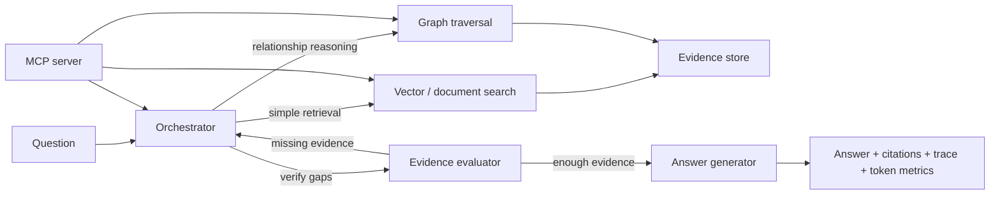

# Round 1 Architecture

## Components

- **RAG** calls document similarity search once.
- **GraphRAG** combines graph relationships with document retrieval.
- **Agentic GraphRAG** chooses retrieval order, checks evidence, and records the investigation trace.
- **MCP** exposes retrieval and investigation tools to VS Code Copilot.
- **Benchmark runner** evaluates the same questions across all three pipelines and writes JSON artifacts.

The checked-in corpus is a deterministic demo corpus. The official TigerGraph corpus and 100 public questions must replace it for the actual submission run.